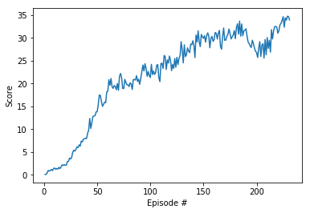
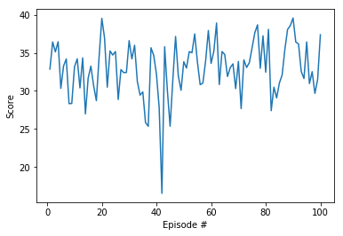

# Train a robotic arm to reach target locations

## Learning Algorithm

The method chosen for solving this environment was the Actor-Critic algorithm Deep Deterministic Policy Gradients ([DDPG](https://arxiv.org/abs/1509.02971))

Training Version 2 of this environment with 20 agents was much easier and faster than training Version 1 with only 1 agent. This project first solved the task for Version 2 and then demonstrated the natural intuition that the learned model should work just as well with Version 1 afterwards.

### Actor Network

The inputs are 33 continuous values representing the state of the environment.
Then there are 2 fully connected Leaky ReLU layers of size 128.
The outputs are 4 continuous values with **tanh** activation representing action values between -1 and 1.
The inputs to each layer are batch normalized.

### Critic Network

The inputs are 33 continuous values representing the state of the environment.
Then there is a fully connected Leaky ReLU layer of size 128.
The output of the previous layer is concatenated with the actions (128 + 4) and sent through another Leaky ReLU layer of size 128.
The network output is a single continuous value without activation.
The state inputs are batch normalized.

### Hyperparameters

These were the hyperparameters used:

    BUFFER_SIZE = int(1e7)  # replay buffer size
    BATCH_SIZE = 256        # minibatch size
    GAMMA = 0.99            # discount factor
    TAU = 1e-3              # for soft update of target parameters
    LR_ACTOR = 1e-4         # learning rate of the actor 
    LR_CRITIC = 1e-3        # learning rate of the critic
    WEIGHT_DECAY = 0        # L2 weight decay

## Plot of Rewards

Version 2 was solved in 231 episodes and seems to be still learning:

Then it was demonstrated that the learned model was working fine with Version 1:

## Ideas for Future Work

The agent solved the task faster with higher learning rates but started deteriorating towards the end of training. Now it doesn't seem to have deteriorated at all. Longer training or lower learning rates could probably get the average score even higher.
There is still lots of unexplored territory regarding network architecture (more layers, different sizes, more or less batch normalization).
Other algorithms would be interesting to benchmark against like [PPO](https://arxiv.org/pdf/1707.06347.pdf), [A3C](https://arxiv.org/pdf/1602.01783.pdf) and [D4PG](https://openreview.net/pdf?id=SyZipzbCb)